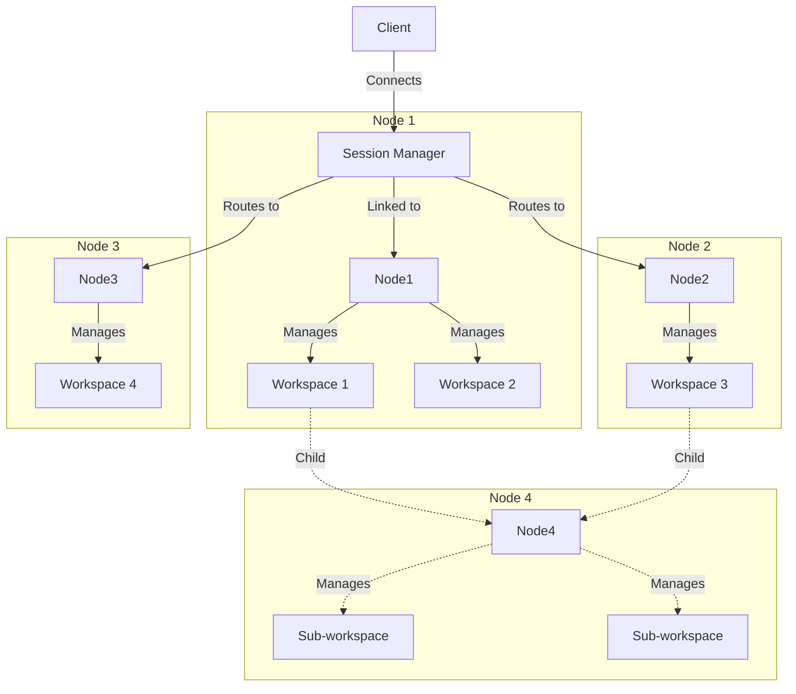
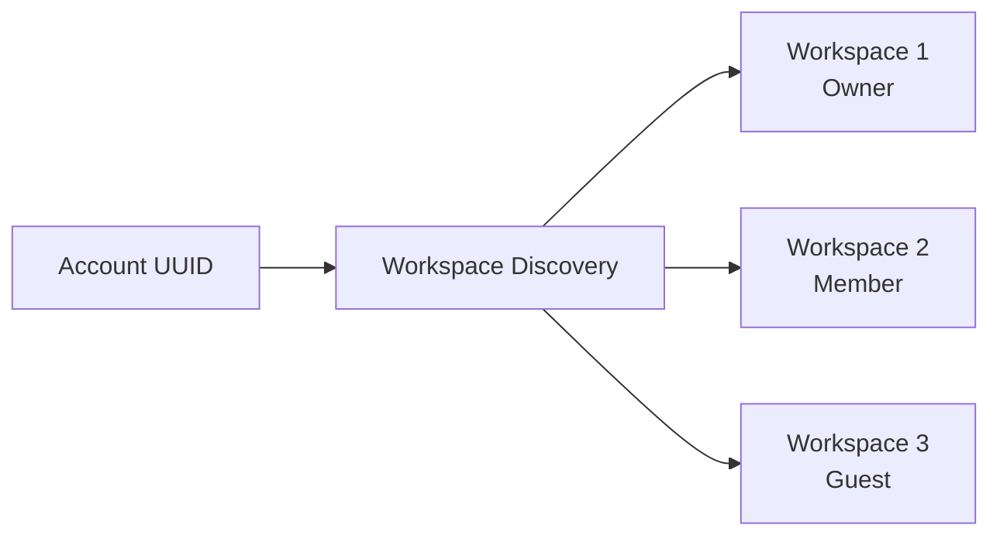
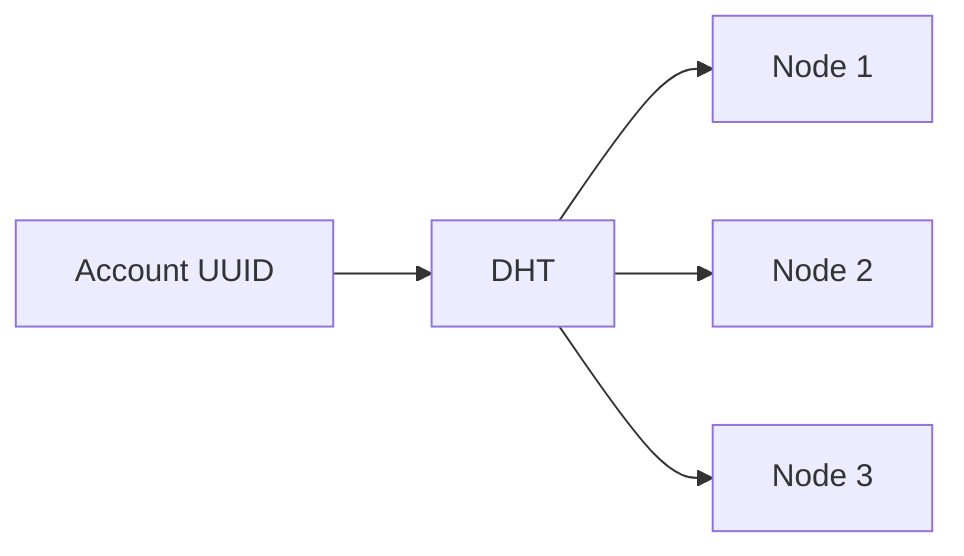
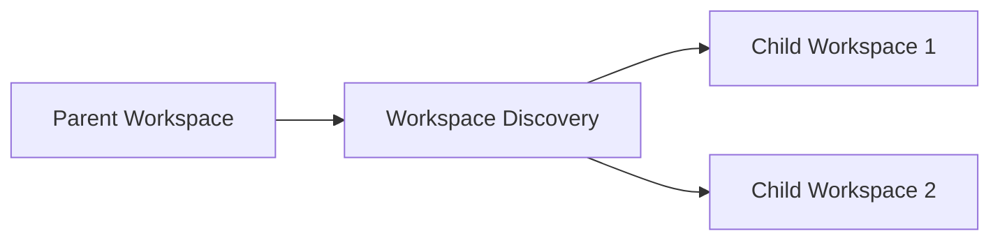
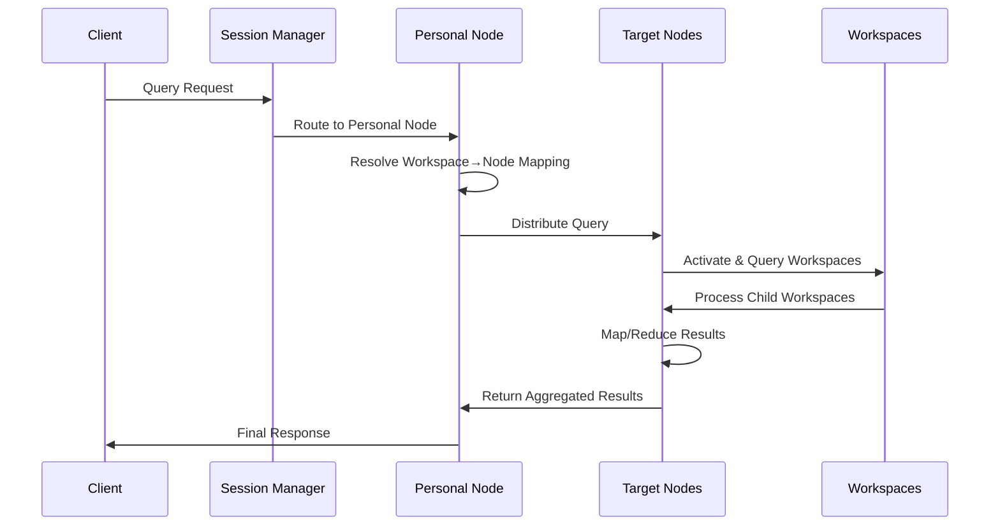
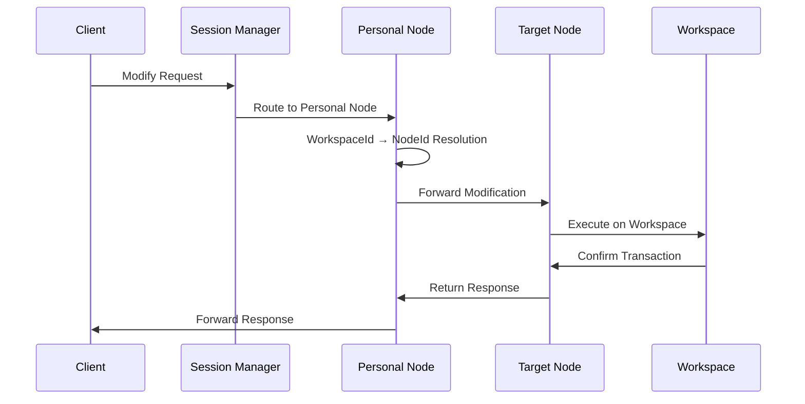
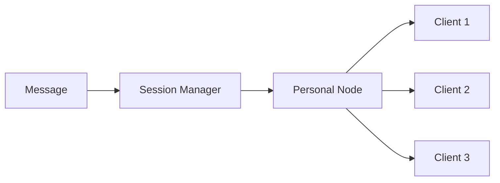
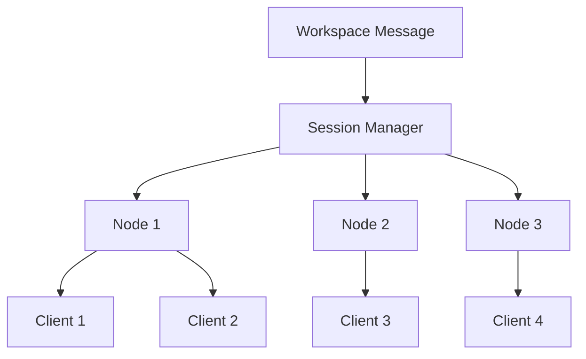

# Huly Virtual Network

A distributed, scalable network architecture for the Huly platform that enables fault-tolerant communication between accounts, workspaces, and nodes in a multi-tenant environment.

## 🚀 Overview

The Huly Virtual Network is a sophisticated distributed system designed to handle enterprise-scale workloads with the following key capabilities:

- **Distributed Load Balancing**: Intelligent routing of accounts across multiple nodes using consistent hashing
- **Multi-Tenant Architecture**: Secure isolation of workspaces with role-based access control
- **Fault Tolerance**: Automatic failover and recovery mechanisms
- **Horizontal Scaling**: Dynamic node discovery and elastic scaling
- **Real-time Communication**: Event-driven architecture with broadcast capabilities


## 🏗️ Architecture Components

### Core Components



### 1. Session Management Layer

The **Session Manager** coordinates virtual client connections to node and perform and collect all reduce requests:

- **Client Authentication**: Token-based authentication with workspace access validation
- **Session Lifecycle**: Connection establishment, maintenance, and cleanup
- **Load Distribution**: Intelligent routing based on account-to-node mapping
- **Real-time Events**: Rich communication with broadcast capabilities

### 2. Node Architecture

**Nodes** are computational units that handle distributed operations:

```typescript
interface Node {
  _id: NodeUuid
  ask: <T>(req: Request<T>, options?: NodeAskOptions) => Promise<RequestAkn>
  modify: <T, V>(workspaceId: WorkspaceUuid, req: Request<T>) => Promise<ResponseValue<V>>
  ping: (workspaces: WorkspaceUuid[], processChildren: boolean) => Promise<void>
  broadcast: <T>(req: Array<Response<T>>) => Promise<void>
  close: () => Promise<void>
}
```

**Key Features:**

- **Query Processing**: Distributed map-reduce operations across workspaces
- **Modification Handling**: Transactional updates with consistency guarantees
- **Health Monitoring**: Continuous ping/pong for node availability
- **Event Broadcasting**: Real-time message distribution

### 3. Workspace Management

**Workspaces** are isolated environments that contain application data:

```typescript
interface Workspace {
  _id: WorkspaceUuid
  ask: <T, V>(req: Request<T>) => Promise<ResponseValue<V>>
  modify: <T, V>(req: Request<T>) => Promise<ResponseValue<V>>
  suspend: () => Promise<void>
  resume: () => Promise<void>
  close: () => Promise<void>
}
```

**Lifecycle Management:**

- **Lazy Loading**: On-demand workspace activation
- **Resource Optimization**: Automatic suspension of inactive workspaces
- **Hierarchical Organization**: Parent-child workspace relationships
- **Health Monitoring**: Continuous workspace health checks

### 4. Discovery Services

Three specialized discovery services manage system topology:

#### Account Discovery

Maps `AccountUuid` to accessible `WorkspaceUuid[]`:



#### Node Discovery

Distributes accounts across nodes using consistent hashing:



#### Workspace Discovery

Resolves workspace child relations:



## 🔄 Core Operations

### Query Operations (Map/Reduce)

Distributed query processing with intelligent routing:



**Process Flow:**

1. **Request Routing**: `AccountUuid` → `NodeId`
2. **Workspace Resolution**: Personal node resolves workspace locations
3. **Distributed Execution**: Query distributed to target nodes
4. **Workspace Activation**: Lazy loading of required workspaces
5. **Hierarchical Processing**: Automatic handling of child workspaces
6. **Result Aggregation**: Map-reduce across distributed results
7. **Response Delivery**: Consolidated response to client

### Modification Operations

Transactional modifications with consistency guarantees:



### Broadcast Operations

Efficient real-time message distribution:

#### Account-Level Broadcast



#### Workspace-Level Broadcast



## 📦 Package Structure

```text
network/
├── core/                    # Core network interfaces and implementations
│   ├── src/
│   │   ├── api/            # Core API definitions
│   │   │   ├── types.ts    # Base type definitions
│   │   │   ├── node.ts     # Node and Workspace interfaces
│   │   │   ├── request.ts  # Request/Response types
│   │   │   ├── discovery.ts # Discovery service interfaces
│   │   │   ├── client.ts   # Client and Session interfaces
│   │   │   ├── transport.ts # Transport layer interfaces
│   │   │   ├── timeouts.ts # Timeout configurations
│   │   │   └── utils.ts    # Utility types and interfaces
│   │   ├── discovery/      # Discovery implementations
│   │   │   └── static.ts   # Static discovery service
│   │   ├── node/           # Node implementations
│   │   │   ├── node.ts     # Node implementation
│   │   │   └── session.ts  # Session management
│   │   ├── utils.ts        # Utility functions
│   │   └── index.ts        # Main exports
│   └── package.json
├── zeromq/                 # ZeroMQ transport implementation
│   ├── src/
│   │   ├── transport/      # Transport implementations
│   │   │   ├── client.ts   # Client transport
│   │   │   ├── server.ts   # Server transport
│   │   │   └── index.ts    # Transport exports
│   │   ├── client/         # Client implementations
│   │   ├── node.ts         # ZeroMQ node implementation
│   │   ├── types.ts        # ZeroMQ specific types
│   │   └── index.ts        # Main exports
│   └── package.json
├── docs/                   # Documentation and diagrams
│   ├── api-reference.md   # Complete API reference
│   └── Schema.png         # Architecture diagram
└── README.md              # This file
```

## 🚀 Getting Started

### Installation

```bash
# Install the network package
npm install @hcengineering/network
```

### Basic Usage

```typescript
import { StaticNodeDiscovery, StaticWorkspaceDiscovery, SessionManagerImpl } from '@hcengineering/network'

// Initialize discovery services
const nodeDiscovery = new StaticNodeDiscovery([
  ['node1', { ... }],
  ['node2', { ... }]
])

const workspaceDiscovery = new StaticWorkspaceDiscovery({
  user1: ['workspace1', 'workspace2'],
  user2: ['workspace3']
})

// Create session manager
const sessionManager = new SessionManagerImpl(nodeImpl, tickManager, workspaceDiscovery, nodeDiscovery)

// Register client session
const client = await sessionManager.register('user1' as AccountUuid, 'session1')

// Perform operations
const queryResult = await client.ask(
  {
    method: 'query-data',
    collection: 'documents'
  },
  {
    workspace: ['workspace1' as WorkspaceUuid]
  }
)

const modifyResult = await client.modify('workspace1' as WorkspaceUuid, {
  method: 'update',
  collection: 'documents',
  data: { status: 'updated' }
})
```

## 🔧 Development

### Building

```bash
# Build the package
npm run build

# Build and watch for changes
npm run build:watch
```

### Testing

```bash
# Run tests
npm test

# Run tests with coverage
npm run test:coverage
```

### Linting

```bash
# Format code
npm run format

# Validate code
npm run validate
```

## 🤝 Contributing

1. **Fork the Repository**: Create your own fork of the Huly platform
2. **Create Feature Branch**: `git checkout -b feature/amazing-feature`
3. **Commit Changes**: `git commit -m 'Add amazing feature'`
4. **Push to Branch**: `git push origin feature/amazing-feature`
5. **Create Pull Request**: Submit your changes for review

### Development Guidelines

- **Code Style**: Follow TypeScript best practices and ESLint rules
- **Testing**: Maintain high test coverage for new features
- **Documentation**: Update documentation for API changes
- **Performance**: Consider performance implications of changes

## 📄 License

This project is licensed under the Eclipse Public License 2.0 (EPL-2.0). See the [LICENSE](../LICENSE) file for details.

## 🔗 Related Projects

- **[Huly Platform](https://github.com/hcengineering/platform)**: Main platform repository
- **[Huly Self-Host](https://github.com/hcengineering/huly-selfhost)**: Self-hosting deployment
- **[Huly Examples](https://github.com/hcengineering/huly-examples)**: API usage examples

## 📞 Support

- **Documentation**: [Platform Documentation](../README.md)
- **Issues**: [GitHub Issues](https://github.com/hcengineering/platform/issues)
- **Discussions**: [GitHub Discussions](https://github.com/hcengineering/platform/discussions)
- **Twitter**: [@huly_io](https://twitter.com/huly_io)

---

Built with ❤️ by the Huly Platform Contributors
