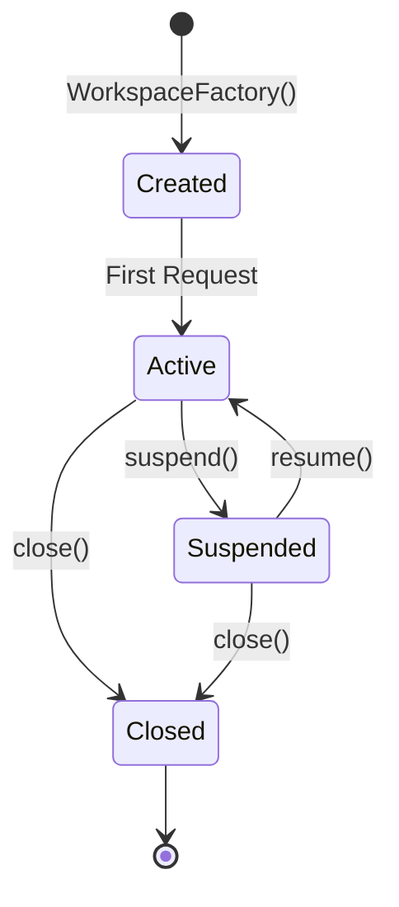

# Huly Network API Reference

Complete API reference for the Huly Virtual Network, including interfaces, types, and usage examples.

## 📚 Table of Contents

- [Core Interfaces](#core-interfaces)
- [Node Management](#node-management)
- [Workspace Operations](#workspace-operations)
- [Discovery Services](#discovery-services)
- [Session Management](#session-management)
- [Request/Response Types](#requestresponse-types)
- [Error Handling](#error-handling)
- [Usage Examples](#usage-examples)

## 🔌 Core Interfaces

### Node Interface

The primary interface for network nodes that handle distributed operations.

```typescript
interface Node {
  /**
   * Unique identifier for the node
   */
  _id: NodeUuid

  /**
   * Send a query request to the node
   * @param req - The request object
   * @param options - Optional request configuration
   * @returns Promise resolving to request acknowledgment
   */
  ask: <T>(req: Request<T>, options?: NodeAskOptions) => Promise<RequestAkn>

  /**
   * Send a modification request to a specific workspace
   * @param workspaceId - Target workspace identifier
   * @param req - The modification request
   * @returns Promise resolving to the response value
   */
  modify: <T, V>(workspaceId: WorkspaceUuid, req: Request<T>) => Promise<ResponseValue<V>>

  /**
   * Health check for workspaces
   * @param workspaces - Array of workspace identifiers to ping
   * @param processChildren - Whether to include child workspaces
   */
  ping: (workspaces: WorkspaceUuid[], processChildren: boolean) => Promise<void>

  /**
   * Inform clients about some request/Response
   * @param req - Array of responses to broadcast
   */
  broadcast: <T>(req: Array<Response<T>>) => Promise<void>

  /**
   * Gracefully close the node and cleanup resources
   */
  close: () => Promise<void>
}
```

### Workspace Interface

Interface for individual workspace instances within nodes.

```typescript
interface Workspace {
  /**
   * Unique identifier for the workspace
   */
  _id: WorkspaceUuid

  /**
   * Execute a query on the workspace
   * @param req - The query request
   * @returns Promise resolving to the query result
   */
  ask: <T, V>(req: Request<T>) => Promise<ResponseValue<V>>

  /**
   * Execute a modification on the workspace
   * @param req - The modification request
   * @returns Promise resolving to the modification result
   */
  modify: <T, V>(req: Request<T>) => Promise<ResponseValue<V>>

  /**
   * Suspend any system resources, be ready for a resume before any new requests.
   */
  suspend: () => Promise<void>

  /**
   * A restore state and be able to respond for user actions.
   */
  resume: () => Promise<void>

  /**
   * Permanently close the workspace and cleanup all resources
   */
  close: () => Promise<void>
}
```

## 🏗️ Node Management

### NodeManager Interface

Central manager for node discovery and access.

```typescript
interface NodeManager extends NodeDiscovery {
  /**
   * Get a node instance by its identifier
   * @param node - Node identifier
   * @returns Promise resolving to the node instance
   */
  node: (node: NodeUuid) => Promise<Node>
}
```

### NodeFactory Type

Factory function for creating node instances.

```typescript
type NodeFactory = (node: NodeUuid) => Promise<Node>
```

### NodeAskOptions

Extended options for node query operations.

```typescript
interface NodeAskOptions extends AskOptions {
  /**
   * Specific workspaces to target for the request
   * If not specified, all accessible workspaces are queried
   */
  target?: WorkspaceUuid[]
}
```

## 🏢 Workspace Operations

### WorkspaceFactory Type

Factory function for creating workspace instances.

```typescript
type WorkspaceFactory = (workspaceId: WorkspaceUuid) => Promise<Workspace>
```

### Workspace Lifecycle

Workspaces follow a specific lifecycle pattern:



### Example Workspace Implementation

```typescript
class WorkspaceImpl implements Workspace {
  constructor(public readonly _id: WorkspaceUuid, private pipeline: Pipeline, private config: WorkspaceConfig) {}

  async ask<T, V>(req: Request<T>): Promise<ResponseValue<V>> {
    try {
      // Validate request
      await this.validateRequest(req)

      // Execute query through pipeline
      const result = await this.pipeline.ask(req)

      // Transform and return result
      return this.transformResponse<V>(result)
    } catch (error) {
      throw new NetworkError('Query failed', { cause: error })
    }
  }

  async modify<T, V>(req: Request<T>): Promise<ResponseValue<V>> {
    try {
      // Start transaction
      const transaction = await this.pipeline.startTransaction()

      // Execute modification
      const result = await transaction.modify(req)

      // Commit transaction
      await transaction.commit()

      return this.transformResponse<V>(result)
    } catch (error) {
      // Rollback on error
      await transaction?.rollback()
      throw new NetworkError('Modification failed', { cause: error })
    }
  }

  async suspend(): Promise<void> {
    await this.pipeline.suspend()
    this.config.suspended = true
  }

  async resume(): Promise<void> {
    await this.pipeline.resume()
    this.config.suspended = false
  }

  async close(): Promise<void> {
    await this.pipeline.close()
  }
}
```

## 🔍 Discovery Services

### NodeDiscovery Interface

Service for discovering and managing node topology.

```typescript
interface NodeDiscovery<NodeDataT extends NodeData = NodeData> {
  /**
   * Get the node responsible for a specific workspace
   * @param workspace - Workspace identifier
   * @returns Node identifier
   */
  byWorkspace: (workspace: WorkspaceUuid) => Promise<NodeUuid>

  /**
   * Get the node responsible for a specific account
   * @param account - Account identifier
   * @returns Node identifier
   */
  byAccount: (account: AccountUuid) => Promise<NodeUuid>

  /**
   * Get all available nodes
   * @returns Iterable of node identifiers
   */
  list: () => Iterable<NodeUuid>

  /**
   * Get statistics/metadata for a specific node
   * @param node - Node identifier
   * @returns Node metadata
   */
  stats: (node: NodeUuid) => Promise<NodeDataT>
}

/**
 * Node metadata type
 */
type NodeData = Record<string, any>
```

### WorkspaceDiscovery Interface

Service for discovering workspace locations and relationships.

````typescript
interface WorkspaceDiscovery {
  /**
   * Get all workspaces accessible by an account
   * @param account - Account identifier
   * @returns Array of workspace identifiers
   */
  byAccount: (account: AccountUuid) => Promise<WorkspaceUuid[]>

  /**
   * Get child workspaces of a parent workspace
   * @param workspace - Parent workspace identifier
   * @returns Array of child workspace identifiers
   */
  byWorkspace: (workspace: WorkspaceUuid) => Promise<WorkspaceUuid[]>
}

### AccountDiscovery Interface

Service for discovering accounts associated with workspaces.

```typescript
interface AccountDiscovery {
  /**
   * Get all accounts that have access to a specific workspace
   * @param workspace - Workspace identifier
   * @returns Array of account identifiers
   */
  byWorkspace: (workspace: WorkspaceUuid) => Promise<AccountUuid[]>
}
````

## 🚀 Transport Layer

### ClientTransport Interface

Interface for client-side transport communication.

```typescript
interface ClientTransport {
  /**
   * Send a request to a specific client
   * @param clientId - Account identifier
   * @param reqId - Request identifier
   * @param body - Request body
   * @returns Promise resolving to response
   */
  request: (clientId: AccountUuid, reqId: RequestId, body: any) => Promise<any>

  /**
   * Subscribe to messages for an account
   * @param account - Account identifier
   */
  subscribe: (account: AccountUuid) => void

  /**
   * Unsubscribe from messages for an account
   * @param account - Account identifier
   */
  unsubscribe: (account: AccountUuid) => void

  /**
   * Close the transport connection
   */
  close: () => Promise<void>
}
```

### ServerTransport Interface

Interface for server-side transport communication.

```typescript
interface ServerTransport {
  /**
   * Node identifier for this transport
   */
  nodeId: NodeUuid

  /**
   * Send a request to a target node
   * @param target - Target node identifier
   * @param body - Request body
   * @returns Promise resolving to response
   */
  request: (target: NodeUuid, body: any) => Promise<any>

  /**
   * Send a message to a target node
   * @param target - Target node identifier
   * @param reqId - Request identifier (optional)
   * @param body - Message body
   */
  send: (target: NodeUuid, reqId: RequestId | undefined, body: any) => Promise<void>

  /**
   * Close the transport connection
   */
  close: () => Promise<void>
}
```

### Static Discovery Implementation

```typescript
class StaticNodeDiscovery implements NodeDiscovery {
  private nodes: Map<NodeUuid, NodeMetadata>
  private accountHashRing: ConsistentHashRing

  constructor(nodes: Array<[NodeUuid, NodeMetadata]>) {
    this.nodes = new Map(nodes)
    this.accountHashRing = new ConsistentHashRing(Array.from(this.nodes.keys()))
  }

  async getAccountNode(account: AccountUuid): Promise<NodeUuid> {
    return this.accountHashRing.getNode(account)
  }

  async getNodes(): Promise<NodeUuid[]> {
    return Array.from(this.nodes.keys())
  }

  async registerNode(node: NodeUuid, metadata: NodeMetadata): Promise<void> {
    this.nodes.set(node, metadata)
    this.accountHashRing.addNode(node)
  }

  async unregisterNode(node: NodeUuid): Promise<void> {
    this.nodes.delete(node)
    this.accountHashRing.removeNode(node)
  }
}
```

## 👥 Session Management

### SessionManager Interface

Central coordinator for client sessions and workspace access.

```typescript
interface SessionManager {
  /**
   * Register a new client session
   * @param account - Account identifier
   * @param sessionId - Session identifier
   * @returns Client interface for the session
   */
  register: (account: AccountUuid, sessionId: string) => Promise<Client>

  /**
   * Unregister and close a client session
   * @param sessionId - Session identifier
   */
  unregister: (sessionId: string) => Promise<void>

  /**
   * Close the session manager and all active sessions
   */
  close: () => void
}
```

### Client Interface

Interface for client sessions to interact with the network.

```typescript
interface Client {
  /**
   * Account associated with this client
   */
  account: AccountUuid

  /**
   * Unique session identifier
   */
  sessionId: string

  /**
   * Send a query request
   * @param req - The request data
   * @param options - Optional request configuration
   * @returns Promise resolving to the response
   */
  ask: <T, V>(req: T, options?: AskOptions) => Promise<ResponseValue<V>>

  /**
   * Send a modification request to a specific workspace
   * @param workspaceId - Target workspace identifier
   * @param req - The modification request data
   * @returns Promise resolving to the response
   */
  modify: <T, V>(workspaceId: WorkspaceUuid, req: T) => Promise<ResponseValue<V>>

  /**
   * Callback for handling broadcast messages
   */
  onBroadcast?: <T>(response: Response<T>) => void

  /**
   * Callback for handling session close
   */
  onClose?: () => void
}
```

## 📨 Request/Response Types

### Core Types

```typescript
/**
 * Unique identifier types
 */
type WorkspaceUuid = string & { __workspaceUuid: true }
type AccountUuid = string & { __accountUuid: true }
type NodeUuid = string & { __nodeUuid: true }

/**
 * Request identifier type
 */
type RequestId = string & { __requestId: true }

/**
 * Request structure
 */
interface Request<T = any> {
  _id: RequestId
  account: AccountUuid

  // Workspace filter
  workspace?: WorkspaceUuid | WorkspaceUuid[]

  workspaces: Record<WorkspaceUuid, NodeUuid> // A list of already processed workspaces.
  data: T
}

/**
 * Response structure
 */
interface Response<T = any> {
  _id: RequestId | undefined
  account: AccountUuid

  nodeId: NodeUuid
  workspaceId: WorkspaceUuid
  data: ResponseValue<T>
}

/**
 * Response value wrapper
 */
interface ResponseValue<T> {
  value: T[]
  total: number
}

/**
 * Request acknowledgment
 */
interface RequestAkn {
  // A list of nodes we need to retrieve data from, or retry to ask again if required.
  workspaces: Record<WorkspaceUuid, NodeUuid>
}
```

### Request Options

```typescript
interface AskOptions {
  /**
   * Specific workspaces to target for the request
   */
  workspace?: WorkspaceUuid[]
}
```

### Node Metadata

```typescript
interface NodeMetadata {
  /**
   * Geographic region where the node is located
   */
  region: string

  /**
   * Processing capacity of the node
   */
  capacity: number

  /**
   * Network endpoints for the node
   */
  endpoints?: {
    internal: string
    external: string
  }

  /**
   * Node status information
   */
  status?: {
    healthy: boolean
    lastSeen: number
    version: string
  }
}
```

## ❌ Error Handling

### NetworkError Class

```typescript
class NetworkError extends Error {
  constructor(message: string, public code?: string, public details?: any) {
    super(message)
    this.name = 'NetworkError'
  }
}
```

### Error Types

```typescript
enum NetworkErrorCode {
  // Connection errors
  CONNECTION_FAILED = 'CONNECTION_FAILED',
  CONNECTION_TIMEOUT = 'CONNECTION_TIMEOUT',
  CONNECTION_REFUSED = 'CONNECTION_REFUSED',

  // Authentication errors
  AUTHENTICATION_FAILED = 'AUTHENTICATION_FAILED',
  AUTHORIZATION_FAILED = 'AUTHORIZATION_FAILED',
  SESSION_EXPIRED = 'SESSION_EXPIRED',

  // Request errors
  INVALID_REQUEST = 'INVALID_REQUEST',
  REQUEST_TIMEOUT = 'REQUEST_TIMEOUT',
  RATE_LIMITED = 'RATE_LIMITED',

  // Workspace errors
  WORKSPACE_NOT_FOUND = 'WORKSPACE_NOT_FOUND',
  WORKSPACE_UNAVAILABLE = 'WORKSPACE_UNAVAILABLE',
  WORKSPACE_SUSPENDED = 'WORKSPACE_SUSPENDED',

  // Node errors
  NODE_NOT_FOUND = 'NODE_NOT_FOUND',
  NODE_UNAVAILABLE = 'NODE_UNAVAILABLE',
  NODE_OVERLOADED = 'NODE_OVERLOADED',

  // System errors
  INTERNAL_ERROR = 'INTERNAL_ERROR',
  SERVICE_UNAVAILABLE = 'SERVICE_UNAVAILABLE',
  MAINTENANCE_MODE = 'MAINTENANCE_MODE'
}
```

### Error Handling Patterns

```typescript
// Retry with exponential backoff
async function retryWithBackoff<T>(
  operation: () => Promise<T>,
  maxRetries: number = 3,
  baseDelay: number = 1000
): Promise<T> {
  let lastError: Error

  for (let attempt = 0; attempt <= maxRetries; attempt++) {
    try {
      return await operation()
    } catch (error) {
      lastError = error

      if (attempt === maxRetries) {
        throw new NetworkError('Max retries exceeded', 'MAX_RETRIES', {
          attempts: attempt + 1,
          lastError
        })
      }

      // Exponential backoff with jitter
      const delay = baseDelay * Math.pow(2, attempt) + Math.random() * 1000
      await new Promise((resolve) => setTimeout(resolve, delay))
    }
  }

  throw lastError
}

// Circuit breaker pattern
class CircuitBreaker {
  private failures: number = 0
  private lastFailTime: number = 0
  private state: 'closed' | 'open' | 'half-open' = 'closed'

  constructor(private failureThreshold: number = 5, private timeout: number = 60000) {}

  async execute<T>(operation: () => Promise<T>): Promise<T> {
    if (this.state === 'open') {
      if (Date.now() - this.lastFailTime > this.timeout) {
        this.state = 'half-open'
      } else {
        throw new NetworkError('Circuit breaker is open', 'CIRCUIT_OPEN')
      }
    }

    try {
      const result = await operation()
      this.onSuccess()
      return result
    } catch (error) {
      this.onFailure()
      throw error
    }
  }

  private onSuccess(): void {
    this.failures = 0
    this.state = 'closed'
  }

  private onFailure(): void {
    this.failures++
    this.lastFailTime = Date.now()

    if (this.failures >= this.failureThreshold) {
      this.state = 'open'
    }
  }
}
```

## 💡 Usage Examples

### Basic Client Usage

```typescript
import { SessionManagerImpl, StaticNodeDiscovery, StaticWorkspaceDiscovery } from '@hcengineering/network'

// Setup discovery services
const nodeDiscovery = new StaticNodeDiscovery([
  ['node1', { region: 'us-east', capacity: 100 }],
  ['node2', { region: 'us-west', capacity: 150 }]
])

const workspaceDiscovery = new StaticWorkspaceDiscovery({
  user1: ['workspace1', 'workspace2'],
  user2: ['workspace3']
})

// Create session manager
const sessionManager = new SessionManagerImpl(nodeFactory, operationHandler, workspaceDiscovery, nodeDiscovery)

// Register client and perform operations
async function example() {
  // Register a new client session
  const client = await sessionManager.register('user1' as AccountUuid, 'session1')

  // Set up broadcast handler
  client.onBroadcast = (response) => {
    console.log('Received broadcast:', response)
  }

  // Perform a query
  const queryResult = await client.ask(
    {
      method: 'findDocuments',
      collection: 'tasks',
      filter: { status: 'active' }
    },
    {
      timeout: 5000,
      useCache: true
    }
  )

  // Perform a modification
  const modifyResult = await client.modify('workspace1' as WorkspaceUuid, {
    method: 'updateDocument',
    collection: 'tasks',
    id: 'task123',
    updates: { status: 'completed' }
  })

  console.log('Query result:', queryResult)
  console.log('Modify result:', modifyResult)
}
```

### Advanced Node Implementation

```typescript
class AdvancedNode implements Node {
  private workspaces: Map<WorkspaceUuid, Workspace> = new Map()
  private circuitBreaker = new CircuitBreaker()

  constructor(public readonly _id: NodeUuid, private workspaceFactory: WorkspaceFactory, private config: NodeConfig) {}

  async ask<T>(req: Request<T>, options?: NodeAskOptions): Promise<RequestAkn> {
    const requestId = generateId()

    try {
      // Process request with circuit breaker
      await this.circuitBreaker.execute(async () => {
        const workspaces = options?.target || (await this.getAvailableWorkspaces())

        // Distribute query across target workspaces
        const promises = workspaces.map(async (workspaceId) => {
          const workspace = await this.getOrCreateWorkspace(workspaceId)
          return workspace.ask(req)
        })

        // Wait for all responses with timeout
        const results = await Promise.allSettled(promises)

        // Aggregate results
        const aggregatedResult = this.aggregateResults(results)

        // Store result for later retrieval
        await this.storeResult(requestId, aggregatedResult)
      })

      return {
        id: requestId,
        acknowledged: true,
        timestamp: Date.now()
      }
    } catch (error) {
      throw new NetworkError('Ask operation failed', 'ASK_FAILED', {
        requestId,
        error: error.message
      })
    }
  }

  async modify<T, V>(workspaceId: WorkspaceUuid, req: Request<T>): Promise<ResponseValue<V>> {
    try {
      const workspace = await this.getOrCreateWorkspace(workspaceId)
      return await workspace.modify(req)
    } catch (error) {
      throw new NetworkError('Modify operation failed', 'MODIFY_FAILED', {
        workspaceId,
        error: error.message
      })
    }
  }

  async ping(workspaces: WorkspaceUuid[], processChildren: boolean): Promise<void> {
    const promises = workspaces.map(async (workspaceId) => {
      try {
        const workspace = this.workspaces.get(workspaceId)
        if (workspace) {
          // Perform health check
          await this.checkWorkspaceHealth(workspace)

          if (processChildren) {
            const children = await this.getChildWorkspaces(workspaceId)
            await this.ping(children, false)
          }
        }
      } catch (error) {
        console.warn(`Ping failed for workspace ${workspaceId}:`, error)
      }
    })

    await Promise.allSettled(promises)
  }

  async broadcast<T>(responses: Array<Response<T>>): Promise<void> {
    // Implement broadcast logic based on your transport layer
    // This could use WebSockets, message queues, etc.
    for (const response of responses) {
      await this.sendToClients(response)
    }
  }

  async close(): Promise<void> {
    // Close all workspaces
    const closePromises = Array.from(this.workspaces.values()).map((ws) => ws.close())
    await Promise.allSettled(closePromises)

    this.workspaces.clear()
  }

  private async getOrCreateWorkspace(workspaceId: WorkspaceUuid): Promise<Workspace> {
    let workspace = this.workspaces.get(workspaceId)

    if (!workspace) {
      workspace = await this.workspaceFactory(workspaceId)
      this.workspaces.set(workspaceId, workspace)
    }

    return workspace
  }

  private aggregateResults(results: PromiseSettledResult<any>[]): any {
    const successful = results
      .filter((result): result is PromiseFulfilledResult<any> => result.status === 'fulfilled')
      .map((result) => result.value)

    // Implement your aggregation logic here
    return successful.reduce((acc, result) => {
      // Merge results based on your data structure
      return { ...acc, ...result }
    }, {})
  }
}
```

### Custom Discovery Service

```typescript
class DatabaseNodeDiscovery implements NodeDiscovery {
  constructor(private database: Database) {}

  async getAccountNode(account: AccountUuid): Promise<NodeUuid> {
    const result = await this.database.query('SELECT node_id FROM account_node_mapping WHERE account_id = ?', [account])

    if (result.length === 0) {
      // Assign node using consistent hashing
      const availableNodes = await this.getNodes()
      const nodeId = this.hashToNode(account, availableNodes)

      // Store mapping in database
      await this.database.execute('INSERT INTO account_node_mapping (account_id, node_id) VALUES (?, ?)', [
        account,
        nodeId
      ])

      return nodeId
    }

    return result[0].node_id as NodeUuid
  }

  async getNodes(): Promise<NodeUuid[]> {
    const result = await this.database.query('SELECT node_id FROM nodes WHERE status = "active"')

    return result.map((row) => row.node_id as NodeUuid)
  }

  async registerNode(node: NodeUuid, metadata: NodeMetadata): Promise<void> {
    await this.database.execute(
      'INSERT OR REPLACE INTO nodes (node_id, metadata, status, last_seen) VALUES (?, ?, "active", ?)',
      [node, JSON.stringify(metadata), Date.now()]
    )
  }

  async unregisterNode(node: NodeUuid): Promise<void> {
    await this.database.execute('UPDATE nodes SET status = "inactive" WHERE node_id = ?', [node])
  }

  private hashToNode(account: AccountUuid, nodes: NodeUuid[]): NodeUuid {
    // Simple hash-based selection
    const hash = this.simpleHash(account)
    const index = hash % nodes.length
    return nodes[index]
  }

  private simpleHash(str: string): number {
    let hash = 0
    for (let i = 0; i < str.length; i++) {
      const char = str.charCodeAt(i)
      hash = (hash << 5) - hash + char
      hash = hash & hash // Convert to 32-bit integer
    }
    return Math.abs(hash)
  }
}
```

---

For more detailed examples and advanced usage patterns, refer to the [Huly Examples Repository](https://github.com/hcengineering/huly-examples).
