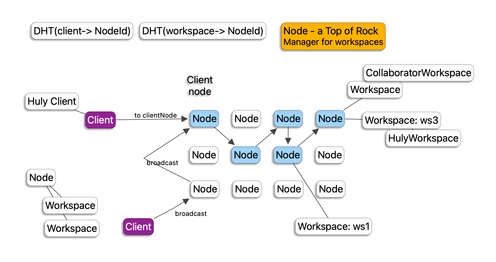

# Huly Virtual Network

A distributed network architecture for the Huly platform that enables scalable, fault-tolerant communication between accounts, workspaces, and nodes.



## Overview

The Huly virtual network implements a distributed system with the following key components:

- **Nodes**: Computational units that handle requests and manage workspaces
- **Workspaces**: Isolated environments that contain application data and logic
- **Accounts**: User identities that can access multiple workspaces
- **Sessions**: Client connections to the network

## Architecture Components

### Account → Workspace Mapping

The `AccountDB` is responsible for mapping `AccountUuid` to `WorkspaceUuid[]` representing all workspaces accessible by a given account.

**Key Features:**

- Multi-tenant workspace access
- Role-based permissions (Owner, Member, Guest)
- Workspace discovery and enumeration

### Account → Node Mapping

Each account is mapped to a specific node using a consistent hashing algorithm:

```text
AccountUuid → hash → DHT → NodeId
```

**Implementation:**

```typescript
hash(AccountUuid) % nodes.length
```

**Benefits:**

- Load balancing across nodes
- Consistent routing for user operations
- Fault tolerance through re-hashing

### Workspace → Workspace Mapping

Workspaces can aggregate content from sub-workspaces, enabling hierarchical organization and unified access patterns.

**Features:**

- Parent-child workspace relationships
- Cascading operations across workspace hierarchies
- Unified query interface for related workspaces

### Workspace Lifecycle Management

Workspaces have complex startup/shutdown cycles managed by the network:

- **Lazy Loading**: Workspaces are activated on-demand
- **Resource Management**: Automatic cleanup of unused workspaces
- **Health Monitoring**: Continuous workspace health checks

## Core Operations

### Query Operations (Map/Reduce)

Distributed query processing across multiple workspaces:

```text
1. Request with RequestId
2. AccountUuid → PersonalId → NodeId (routing)
3. Post request to Personal NodeId
   3.1 Personal Node: Resolve workspace → NodeIds mapping
   3.2 Personal Node: Distribute query to required nodes
      4.1 Target Nodes: Check workspace status, activate if needed
      4.2 Target Nodes: Execute query on workspace
      4.3 Target Nodes: Process child workspaces if applicable
      4.4 Target Nodes: Subscribe to workspace changes
      4.5 Target Nodes: Perform map/reduce on results
      4.6 Target Node: Pass result to personal Node.
   3.3 Personal Node: Pass result to client.
   3.4. Collect and aggregate responses
   3.5. Handle retries for failed workspaces
   3.6. Cancel requests when needed
   3.7. Return final response to client
```

### Modify Operations

Transactional modifications across the distributed system:

```text
1. Request with RequestId
2. AccountUuid + PersonalId → NodeId (routing)
3. Post to Personal NodeId
   3.1 Personal Node: WorkspaceId → NodeId resolution
    4.1 Target Node: Execute operation on workspace
    4.2 Target Node: Return response to personal node
   3.2 Personal Node: Forward response to client
```

### Broadcast Operations

Efficient message distribution to multiple clients:

**Account Broadcast:**

```text
1. AccountUuid → PersonalId → NodeId (targeting)
2. Post message to client's personal node
3. Node broadcasts to all connected clients
```

**Workspace Broadcast:**

```text
1. WorkspaceId → AccountUuid[] → NodeId[] (fan-out)
2. Broadcast to all relevant nodes
3. Each node broadcasts to its connected clients
```

## Implementation Details

### Core Interfaces

**Node Interface:**

```typescript
interface Node {
  _id: NodeUuid
  ask: <T, V>(req: Request<T>, options?: AskOptions) => Promise<RequestAkn>
  modify: <T, V>(workspaceId: WorkspaceUuid, req: Request<T>) => Promise<ResponseValue<V>>
  ping: (accounts: AccountUuid[]) => Promise<void>
  broadcast: <T>(req: Array<Response<T>>) => Promise<void>
  close: () => Promise<void>
}
```

**Workspace Interface:**

```typescript
interface Workspace {
  _id: WorkspaceUuid
  lastUse: number
  ask: <T, V>(req: Request<T>) => Promise<ResponseValue<V>>
  modify: <T, V>(req: Request<T>) => Promise<ResponseValue<V>>
  ping: () => void
  close: () => Promise<void>
}
```

### Discovery Services

**Node Discovery:**

- Hash-based node selection
- Health monitoring and failover
- Dynamic node registration/deregistration

**Workspace Discovery:**

- Account-to-workspace mapping
- Workspace hierarchy resolution
- Real-time workspace availability

### Session Management

**Client Session:**

```typescript
interface Client {
  account: AccountUuid
  sessionId: string
  ask: <T, V>(req: T, options?: AskOptions) => Promise<ResponseValue<V>>
  modify: <T, V>(workspaceId: WorkspaceUuid, req: T) => Promise<ResponseValue<V>>
  onBroadcast?: <T>(response: Response<T>) => void
  onClose?: () => void
}
```

## Usage Examples

```typescript
// Initialize node discovery
const nodeDiscovery = new StaticNodeDiscovery([
  ['node1', { region: 'us-east', capacity: 100 }],
  ['node2', { region: 'us-west', capacity: 150 }]
]);

// Create workspace discovery
const workspaceDiscovery = new StaticWorkspaceDiscovery({
  'user1': ['workspace1', 'workspace2'],
  'user2': ['workspace3']
});

// Initialize session manager
const sessionManager = new SessionManagerImpl(nodeFactory, operationHandler, workspaceDiscovery, nodeDiscovery);

// Register client
const client = await sessionManager.register('user1', 'session1');

// Perform operations
const result = await client.ask('query-data', { workspace: ['workspace1'] });
await client.modify('workspace1', { action: 'update', data: {...} });
```
